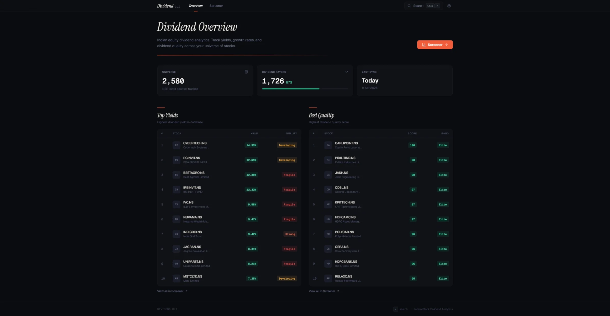

# Dividend CLI



`dividend-cli` is an Indian dividend research platform for NSE stocks, REITs, and INVITs.

It started as a CLI and now ships with a full local web UI. The goal is simple: make dividend research faster, clearer, and a lot less misleading.

## Why this exists

Most screeners focus on a snapshot yield. That misses the bigger picture:

- did the dividend actually grow over time?
- did it get cut?
- did the company stop paying it?
- did splits make the history look smaller than it really was?

`dividend-cli` is built to answer those questions properly.

## What it does

- **Split-aware dividend history**: shows raw payouts and forward-adjusted income from 1 original share
- **Dividend growth analytics**: CAGR over multiple periods, excluding incomplete current-year data
- **Dividend Quality Score**: a 0-100 score that rewards stable, growing annual dividends
- **Consistency tracking**: counts years of increases, stalls, reductions, and stoppages
- **Power-user filtering**: regular flags plus `--condition` expressions for custom screening logic
- **Local SQLite storage**: everything stays fast and searchable on your machine
- **Web UI**: browse top ideas, screen stocks, inspect detail pages, and run updates in the browser
- **Stocks, REITs, and INVITs**: works across the dividend universe on NSE

## Release highlights

### v1.1.0

- Added the local web UI via `dividend-cli serve`
- Replaced the old volatility-first framing with Dividend Quality
- Added quality-based ranking and filtering
- Redesigned the homepage, screener, stock page, and update flow
- Fixed contradictory yield displays by keeping the app's yield definition consistent

## Installation

### Option 1: Pre-built executables

Download the binary for your OS from GitHub Releases.

### Option 2: From source

```bash
git clone https://github.com/Santhosh-004/dividend-cli.git
cd dividend-cli
pip install -r requirements.txt
pip install -e .
```

## Quick Start

### 1) Load data (can also be done from the web UI)

```bash
dividend-cli update
```

If you want to test first:

```bash
dividend-cli update --limit 50
```

### 2) Open the web UI

```bash
dividend-cli serve
```

This starts the app at `http://127.0.0.1:7788` and opens it in your browser.

### 3) Inspect a stock

```bash
dividend-cli stats HDFCBANK.NS
dividend-cli stats INDIGRID.NS
dividend-cli stats CAPLIPOINT.NS
```

### 4) Screen for ideas

```bash
# High yield + growth
dividend-cli filter --min-yield 1.5 --div-5yr-min 10

# Strong dividend quality
dividend-cli filter --min-div-quality 75

# Long streak of dividend increases
dividend-cli filter --years-up 7 --years-stopped 0
```

## Core ideas

### Split-adjusted dividend history

The tool shows both:

- **Raw** dividends: what was actually paid per share
- **Forward-adjusted** income: what 1 original share would have earned after splits

That makes long histories much easier to read honestly.

### Dividend Quality Score

The old CV/stability approach could punish great dividend growers just because they grew a lot.

The new **Dividend Quality Score** looks at:

- dividend increases
- flat years
- reductions
- stoppages
- long-term growth
- the shape of the annual trend

Ratings:

- `Elite`
- `Strong`
- `Developing`
- `Fragile`

## CLI examples

### Stats

```bash
dividend-cli stats HDFCBANK.NS
```

You’ll see:

- stock splits
- yearly consolidated dividends
- CAGR by period
- dividend quality breakdown
- year-over-year summary
- recent payments
- fundamentals snapshot if available

### Filter

```bash
# Quality-first screen
dividend-cli filter --min-div-quality 80 --min-roe 15

# Reliable growers
dividend-cli filter --years-up 5 --div-5yr-min 8 --years-stopped 0

# Higher yield, but not a broken history
dividend-cli filter --min-yield 4 --years-stopped 1
```

### Custom conditions

```bash
# Growth years should dominate bad years
dividend-cli filter --condition "years_up >= 2 * (years_stalled + years_reduced)"

# Strong quality and acceptable yield
dividend-cli filter --condition "dq_score >= 80 and yld > 1"

# Recent growth stronger than long-term baseline
dividend-cli filter --condition "c3 > c10 and c3 > 15"
```

## Condition variables

| Variable                                      | Meaning                                             |
| --------------------------------------------- | --------------------------------------------------- |
| `yld` / `last_yield`                          | last completed year's dividend yield (%)            |
| `years_up` / `up`                             | years dividend increased                            |
| `years_stalled` / `stalled`                   | years dividend stayed flat                          |
| `years_reduced` / `reduced`                   | years dividend was reduced                          |
| `years_stopped` / `stopped`                   | years dividend was zero                             |
| `div_growth` / `div_growth_overall`           | overall dividend CAGR                               |
| `c3`, `c5`, `c10`, `c15`, `c20`, `c25`, `c30` | period CAGR values                                  |
| `dq_score` / `dividend_quality_score`         | dividend quality score (0-100)                      |
| `dq_rating` / `dividend_quality_rating`       | quality rating                                      |
| `div_mean`                                    | mean yearly dividend                                |
| `div_std`                                     | standard deviation of yearly dividends              |
| `div_cv`                                      | legacy coefficient of variation                     |
| `price`                                       | current market price                                |
| `shares`                                      | shares resulting from 1 original share after splits |

See `CONDITIONS.md` for more examples.

## Web UI

```bash
dividend-cli serve
```

The UI includes:

- **Overview**: top yields and best quality names
- **Screener**: presets + custom filters
- **Stock pages**: annual dividend charts, quality breakdown, recent payments, fundamentals
- **Update page**: refresh data from the browser

## Notes

- Current-year data is excluded from growth calculations because it may be incomplete.
- Yield shown in the app is computed consistently from the dividend history and price on the last dividend date.
- Vendor fundamentals can disagree with computed values, so the app prefers its own consistent yield calculation for display.

## Requirements

- Python 3.9+
- `pandas`, `click`, `tabulate`, `tqdm`, `requests`, `yfinance`, `fastapi`, `uvicorn`

## Disclaimer

This tool is for research and educational use only. Always verify dividend and corporate action data with official filings before making investment decisions.
